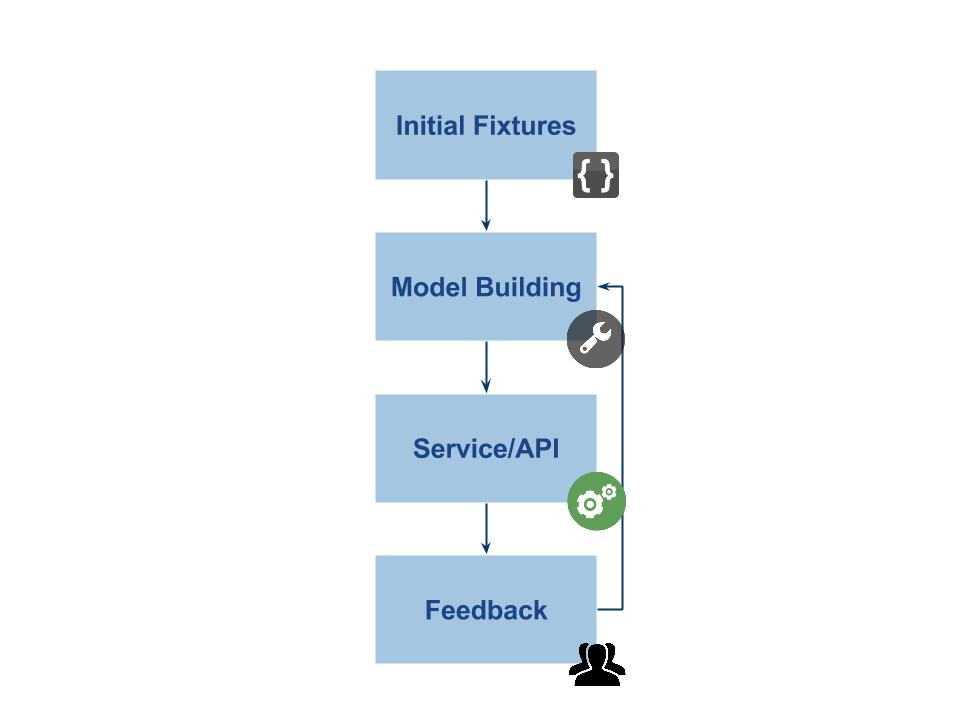
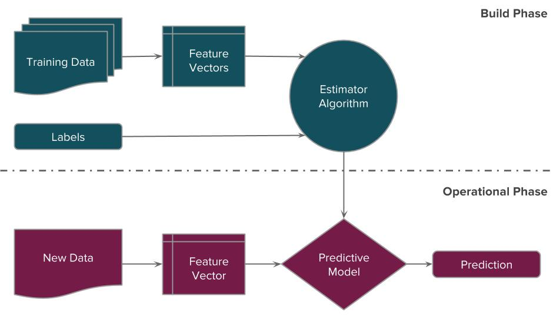
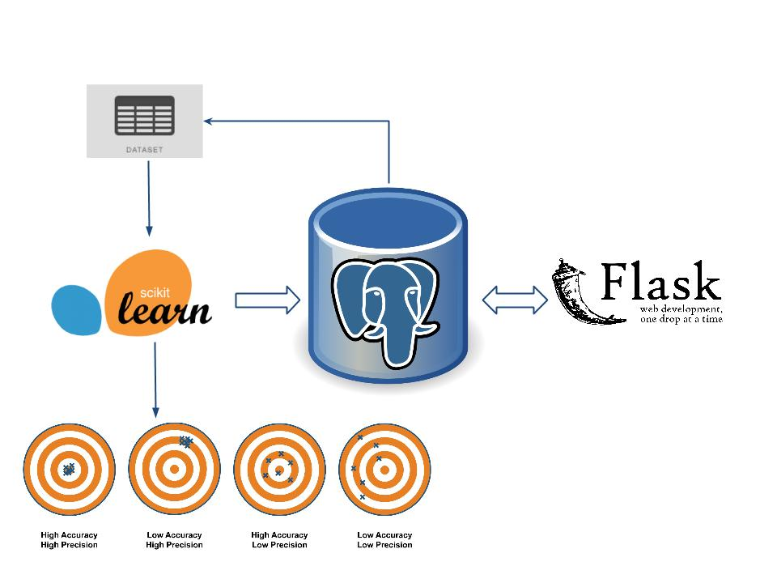
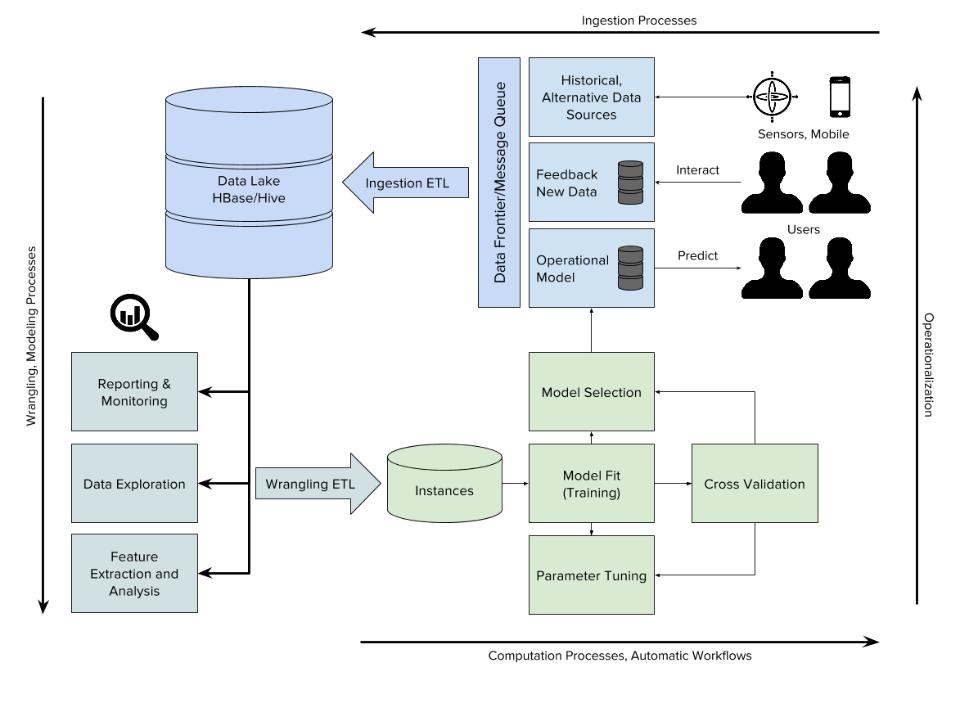

  

    
At the center of the diagram is a PostgreSQL database that acts to both power the web application and also as a computation data store for the instances.       

First, the data is loaded into the database, then a SQL query is used to join the data as necessary. The data is piped into Scikit-learn, which runs a set of models and evaluates those models, selecting the best one and dumping the pickled results back to the database. As the user engages with the front end, the web application goes to the database to retrieve the most recent best model, loads the pickled version and make predictions to deliver to the user. As the user interacts with the web application, it logs the interaction data, **which can be used to refine the model**, storing back to the database to be added to future fit-predict cycles, and allowing the application to learn and improved over time.    

  - build phase ends up in the computational datastore    
  - central application leads down to operational phase    
  - feeds back into model and application    
