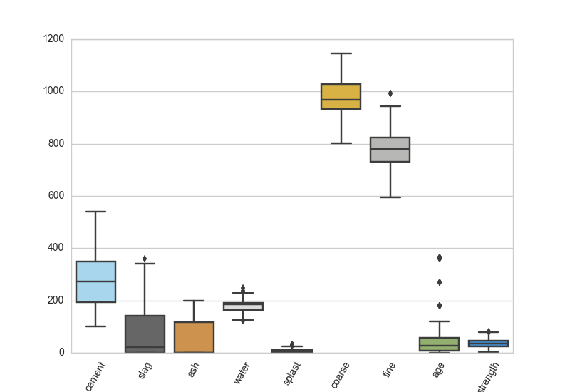
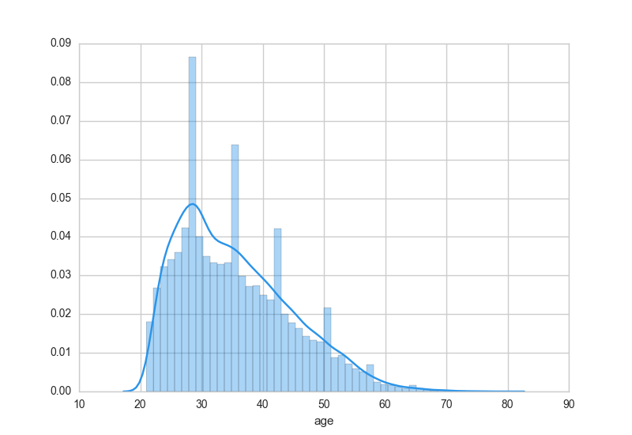
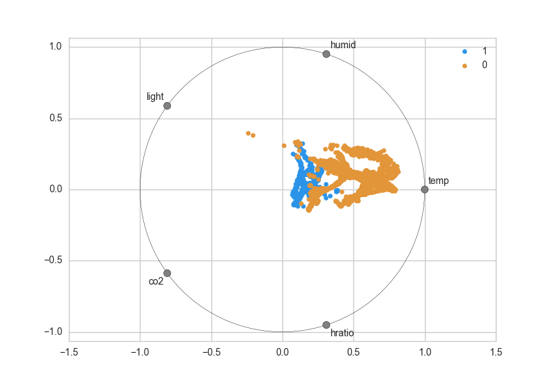
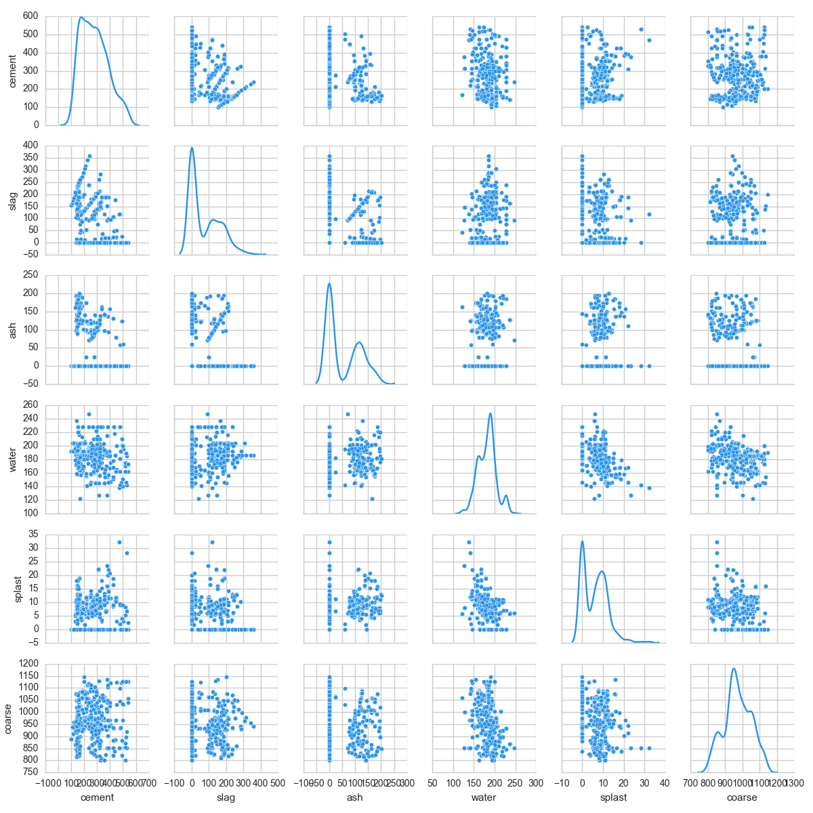
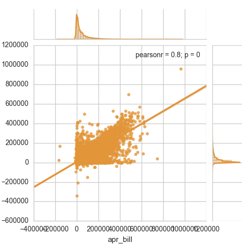
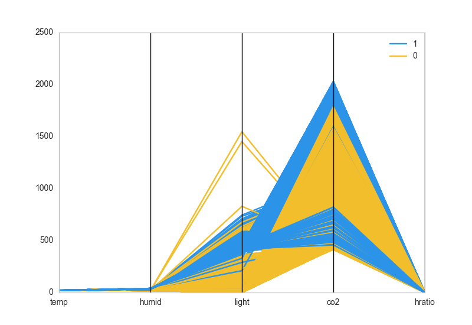
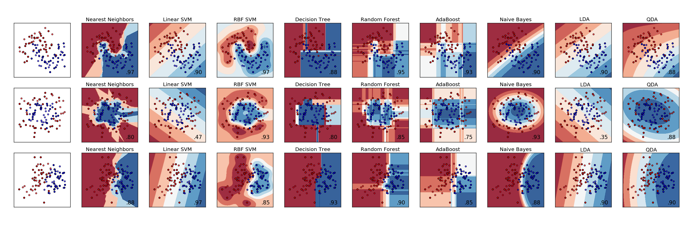
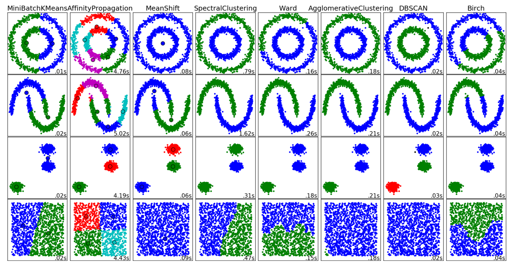
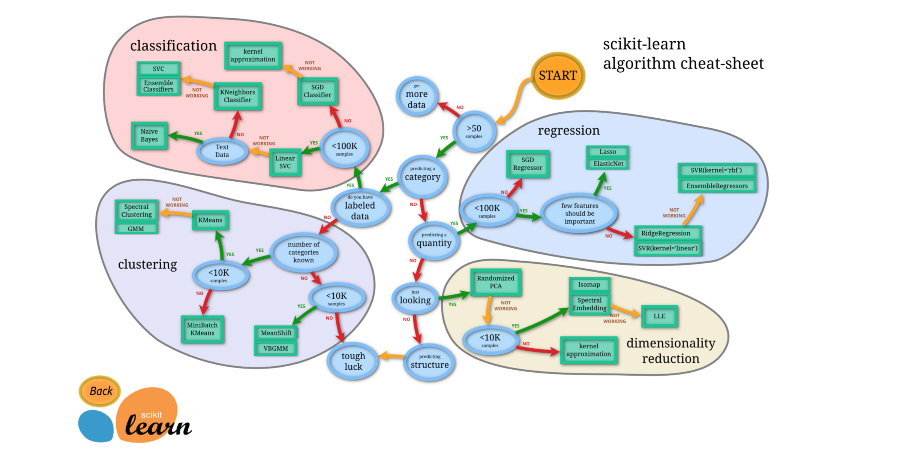
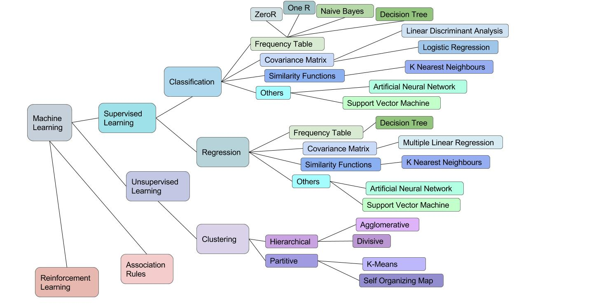

<section data-markdown>
# Visual Diagnostics for More Informed Machine Learning
## Within and Beyond Scikit-Learn

_presented by Rebecca Bilbro_    
May 30, 2016
</section>

<section data-markdown>
# Nice to meet you
</section>

<section data-markdown>
# Where this is going
  1. Kansas    
  2. Oz    
  3. Yellow brick road    
  4. Ruby slippers    
</section>

<section data-markdown>
# True or False? (1)
"Machine learning is hard"
True or False?
</section>

<section data-markdown>
# True or False? (2)
"Machine learning is hard"
__False__     
</section>

<section data-markdown>
# Instantiating and fitting a model
```python
from sklearn.linear_model import LinearRegression    
model = LogisticRegression()    
model.fit(X,y)    
model.predict(X)    
```
</section>

<section data-markdown>
# How to do it (1)
  1. Get data    
  2. Prep data    
  3. Pick model    
  4. Fit model     
  5. Validate model    
  6. Use model    
</section>

<section data-markdown>
# How to do it (2)
  1. Get data    
  2. __Prep data__    
  3. __Pick model__    
  4. __Fit model__     
  5. __Validate model__    
  6. Use model   
</section>

<section data-markdown>
# Prep data
```python
import pandas as pd    
df = pd.read_csv(PATH)

df.describe()

df["col_w_missing_vals"].fillna(df["col_w_missing_vals"].mean(), inplace=True)

features = df[['attribute1','attribute2','attribute3',...]]
labels   = df['target']

from sklearn.preprocessing import scale
scaled_features = scale(features)
```
</section>

<section data-markdown>
# Pick model

</section>

<section data-markdown>
# Fit model
```python
from sklearn.linear_model import LinearRegression    
model = LogisticRegression()    
model.fit(X,y)    
model.predict(X)    
```
</section>

<section data-markdown>
# Validate model
```python
from sklearn.metrics import mean_squared_error
from sklearn.metrics import r2_score
print mse(expected, predicted)
print r2_score(expected, predicted)

from sklearn.metrics import classification_report
print classification_report(expected, predicted)
```
</section>

<section data-markdown>
# True or False? (1)
"Informed machine learning is hard"
True or False?
</section>

<section data-markdown>
# True or False? (2)
"Informed machine learning is hard"
__True__     
</section>

<section data-markdown>
# Oz!

</section>

<section data-markdown>
# Visual feature analysis (1)

</section>

<section data-markdown>
# Visual feature analysis (2)

</section>

<section data-markdown>
# Visual feature analysis (3)

</section>

<section data-markdown>
# Visual feature analysis (4)

</section>

<section data-markdown>
# Visual feature analysis (5)

</section>

<section data-markdown>
# Visual feature analysis (6)

</section>

<section data-markdown>
# Visual model selection (1)

</section>

<section data-markdown>
# Visual model selection (2)

</section>

<section data-markdown>
# Visual model selection (3)

</section>

<section data-markdown>
# Visual model selection (4)

</section>

<section data-markdown>
# Visual evaluation (1)
</section>

<section data-markdown>
# Visual evaluation (2)
</section>

<section data-markdown>
# Visual evaluation (3)
</section>

<section data-markdown>
# Visual evaluation (4)
</section>

<section data-markdown>
# Blind grid search
</section>

<section data-markdown>
# Better grid search
</section>

<section data-markdown>
# Visual tuning (1)
</section>

<section data-markdown>
# Visual tuning (2)
</section>

<section data-markdown>
# Visual tuning (3)
</section>

<section data-markdown>
# Visual tuning (4)
</section>

<section data-markdown>
# Workflow
  1. feature engineering     
  2. algorithm selection     
  3. parameter tuning    
</section>

<section data-markdown>
# Ruby slippers

</section>

<section data-markdown>
# Wishlist (1)
</section>

<section data-markdown>
# Wishlist (2)
</section>

<section data-markdown>
# Wishlist (3)
</section>

<section data-markdown>
# Facilitating science
</section>
